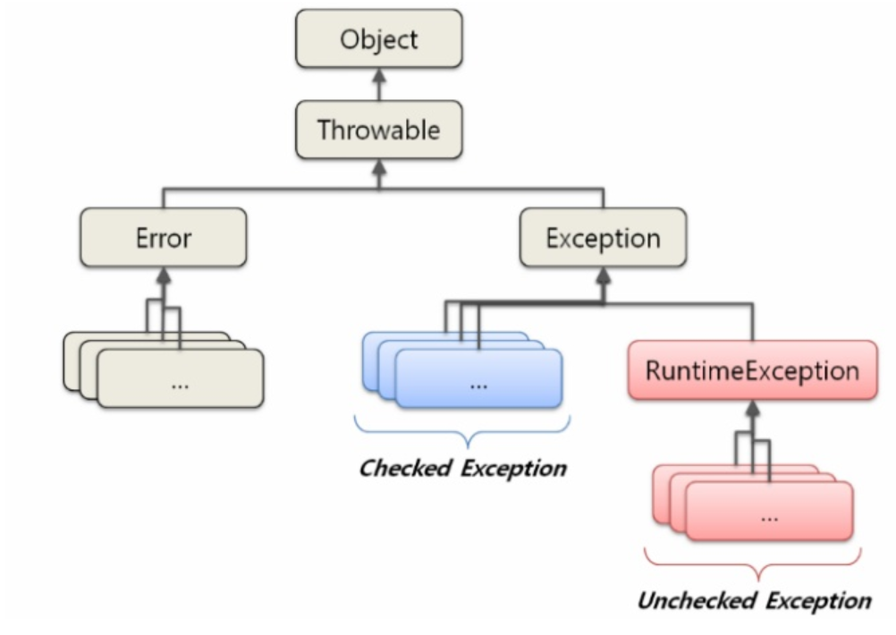
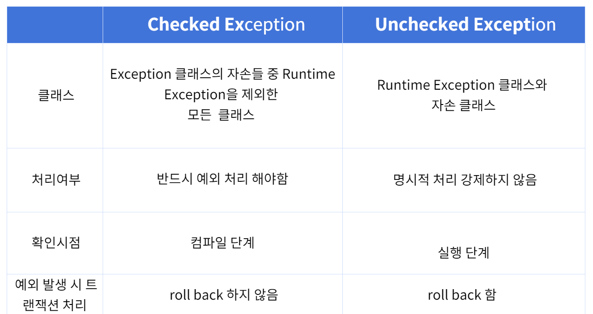

언제까지 try-catch만 사용하면서 예외처리를 할 것인가!!! 런타임에 생길 수 있는 에러에 대해 처리하여 조금 더 빠르게 에러에 대응할 수 있는 코드를 작성하자. 

<!--more-->
---

## 예외처리


프로그램을 만들다보면 알지 못하는 error가 자주 발생한다. 우리는 이러한 error들은 모두 관리해줘야 한다. 그렇지 않으면,,,, 나는 문제가 생겼을 때 해결하지 못한다. 

그것을 위해 우리는 나타날 수 있는 error에 대해 예외처리를 만든다. 

예외처리에는 크게 **Checked Exception** 과 **Unchecked Exception**이 있다. 

**Checked Exception**의 경우 반드시 해야하는 것이다. 그렇지 않으면 **컴파일 타임**에 에러가 발생한다. 

**Unchecked Exception**의 경우 **런타임**에 에러가 발생한다. 그렇기 때문에 코드를 작성하고 컴파일 하는 시간에서는 에러가 나지 않는다. 



그렇기에 우리는 **Unchecked Exception**을 주의깊게 살펴볼 필요가 있다. 보통 try-catch 또는 try-with-resource를 사용하여 예외를 처리한다. 아니면 예외를 throw하기도 한다. 

하지만 Unchecked Exception의 경우 error가 발생하는지 하지 않는지 알 수 없기 때문에 우리는 새로운 Exception class를 만들어서 직접 예외를 관리해줘야 한다. 

**Checked Exception과 Unchecked Exception 특징**



**예시**

```java
public class Calculator {
	private int leftValue;
    private int rightValue;
    
    public int divide(int leftValue, int rightValue) {
        return leftValue / rightValue;
    }
}
```

위와 같은 코드가 있다고 가정할 때, 몇 가지 에러가 생길 수 있다. 간단하게 

rightValue = 0 이라고 하자. 

그러면 나누는 값이 0이 되어 error가 발생한다. 이렇게 **컴파일 타임**에는 알 수 없지만 **런타임**에 생기는 에러가 있기 마련이다. 이러한 상황을 고려하여 우리는 예외에 대해 에러를 발생시켜 줘야 한다. 


```java
public class Calculator {
	private int leftValue;
    private int rightValue;
    
    public int divide(int leftValue, int rightValue) {
        return leftValue / rightValue;
    }
}

public class DivedeRightValueIsZeroException extends Exception {
    
   	private String errorMessage;
    private int errorCode;
    
    public DivedeRightValueIsZeroError (String errorMessage, 
           int errorCode) {
        super(errorMessage);
        this.errorCode = errorCode;
    }
    
    public int getErrorCode() {
        return errorCode;
    }
}
```

위 처럼 사용자가 **Exception**을 정의한다면 예측되는 에러 사항에 예외를 던질 수 있다. 


```java
public class ExceptionTest throws DivedeRightValueIsZeroException  {

    public void static Main(String[] args) {
        Calculator calculator = new Calculator;
	   	int leftValue = 1;
        int rightValue = 0; 
        
        if (rightValue == 0) {
            throw new DivedeRightValueIsZeroException("rightValue가 0값을 가지고 있어 divide를 진행할 수 없습니다.", 4001);
        }        
        calculator.divide(leftValue, rightValue);
    }
}
```

위와 같은 식으로 컴파일 타임에 생길 수 있는 에러에 대해서 사용자가 예외 클래스를 정의하여 처리할 수 있다. 

생각보다 많은 상황속에서 예외가 발생할 수 있다. 코드를 작성할 때에는 생겨날 수 있는 예외에 대해 생각하고 그것에 대한 예외처리를 분명하게 해줘야 한다. 그렇지 않으면 나중에 디버깅 하기가 굉장히 어려워질 수 있다. 