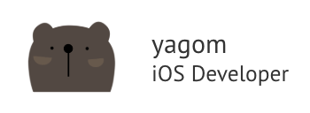

내가 iOS 개발을 하면서 자주 사용하는 Document들을 정리해보았다. 이제 더 이상 내 즐겨찾기에서 페이지를 찾기가 너무 힘들다. 그래서 만들었다 .

<!--more-->

# iOS Document Collection

### Hacking With SWIFT

> <https://www.hackingwithswift.com/>

보통 원하는 구현을 찾으려고 할 때 가장 자주 등장하는 페이지이다. 이 페이지의 경우 필요한 부분만 간단하게 설명해준다. 가장 많이 찾게되는 페이지 인 것 같다.

### raywenderlich

> <https://www.raywenderlich.com/4001741-swiftui>

SwiftUI에 대한 정보를 얻고자 할 때 자주 사용하는 페이지이다. 이 페이지같은 경우 Hacking With SWIFT와 달리 특정 항목에 대한 커리큘럼을 갖고 정보들을 전달해준다. 하나씩 따라하며 배우고싶을 때 위 페이지를 이용하면 좋을 것 같다. 

### Zedd's Blog

> <https://zeddios.tistory.com/category/iOS>

내가 자주 보는 블로그 중에 큰 도움을 받았던 Zedd님의 blog이다. 심심할 때 게시글 하나씩 보면 재밌다… 그렇게 보다보면 내가 뭘 또 모르는지 끝없이 알 수 있기에 도움이 된다. 

### yagom's Blog

> <https://blog.yagom.net/>

국내 iOS 개발자중에 (개인적인 생각) 굉장히 유명한 분이라고 생각한다. 그래서 블로그도 자주 보게 되는 것 같다. 따라가려고… 

## [ Official ] 

### Swift.org

> <https://swift.org/>

Swift 공식 문서… 제일 많이 봐야 하는 페이지임에도 불구하고 구글링의 도움을 얻는다. 반성하자...

### Apple 공식 Documentation Archive

> <https://developer.apple.com/library/archive/navigation/#section=Platforms&topic=iOS>

공식 iOS Document와 Archive되어 있는 페이지. 조금 더 쉽게 공식 문서를 열람해볼 수 있다. 

### Apple Human Design Guide

> <https://developer.apple.com/design/human-interface-guidelines/ios/overview/themes/>

Apple에서 공식적으로 제공해주는 Design Guide. 

제대로 읽어본 적은 없다… 

### Swift Document (한글판)

> <https://jusung.gitbook.io/the-swift-language-guide/>

Swift 문서들이 한글로!!

### cocoaPods

> <https://cocoapods.org/>

코코아팟 공식 문서! 

## [ etc ]

### iOS Fonts

> <http://iosfonts.com/>

iOS 관련 폰트들을 찾을 수 있는 페이지 

### iOS Libraries

> <https://github.com/vsouza/awesome-ios>

iOS 관련 Library들이 깔끔하게 정리되어 있다고 하는데 한 번 나중에 봐야겠다. 

### Swift for Beginner

> <https://github.com/ClintJang/awesome-swift-korean-lecture>

초심자를 위한 Swift 자료들

### Link for iOS Developer

> <https://github.com/giftbott/iOSDevLinks>

iOS 개발자가 알면 좋은 링크들이라는데,,, 아직 제대로 활용해본적은… 없음 

### Swift Style Guide

> <https://github.com/raywenderlich/swift-style-guide>

Swift 작성 스타일 가이드! 

