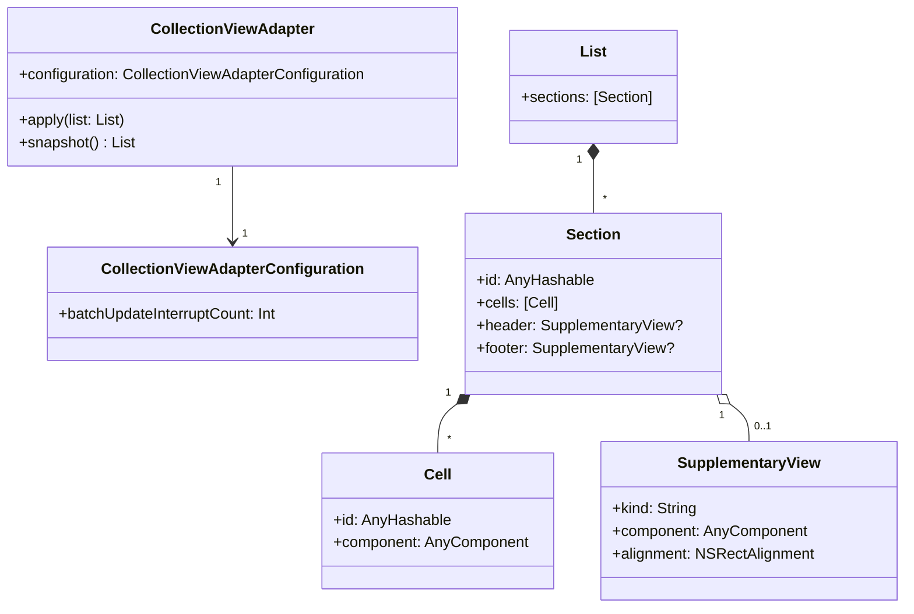
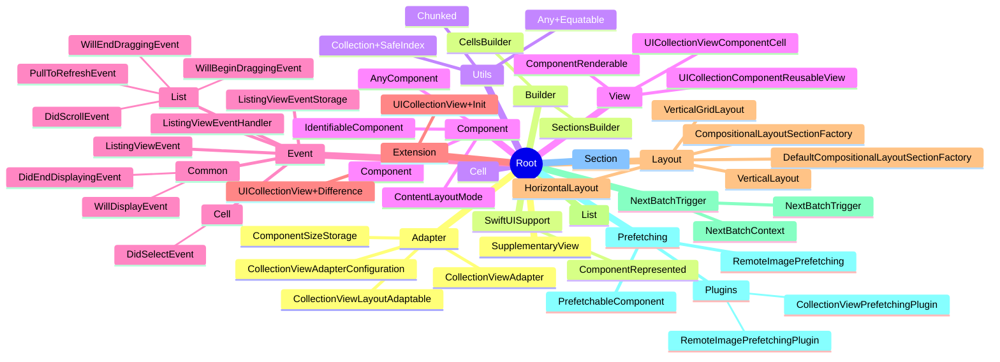

라이브러리를 자주 분석하다보니 라이브러리를 분석해주는 도구가 있으면 어떨까 싶은 생각에 툴을 만들어봤습니다. 

<!--more-->

# 1. 서론

Generative AI 시대가 도래하는데 AI를 좀 더 활용할 방법은 없을까 많이 고민하게 되었습니다. 그러다 내가 공부해야 할 자료들을 정리해주는 도구를 만들면 어떨까 싶었습니다. 

그래서 이번 기회에 내가 공부해야 할 라이브러리를 대신 분석해서 정리해주는 도구를 만들면 좋을 것 같았습니다.

앞으로의 내용은 OpenAI 를 이용하여 라이브러리를 분석하는 과정을 담았습니다. 라이브러리의 분석 내용과 OpenAI 사용법이 함께 담겨 있어 혼잡할 수 있음을 미리 양해부탁드리겠습니다. 

# 2. 라이브러리 선정

분석할 라이브러리는 당근마켓의 `KarrotListKit` 입니다.

- 현재 Dooray! iOS App의 기술스택과 동일한 UIKit 기반으로 설계되어 어떻게 만들었는지 궁금했다.
- 이전에 사용해보지 않은 “DifferenceKit” 을 사용하고 있었고 어떻게 사용했는지 궁금했다.
- 크기가 작은 프로젝트로 간단히 분석해 볼 수 있을 것 같았다.

# 3. OpenAI API 를 이용하여 분석툴 구성하기

## 1. 사용 언어

저는 python을 사용하였습니다. 사실 swift 를 제외한 다른 언어에 대해서는 익숙치 않아서 가장 간단히 사용할 수 있는 언어를 선택하였습니다. 

## 2. OpenAI API 이해하기

https://platform.openai.com/docs/assistants/how-it-works/objects

: 저도 처음 알게 된 부분이지만 최대한 간단하게 OpenAI API 에 대해서 설명해보도록 하겠습니다. 


### 2.1. 구성요소

: OpenAI API 는 크게 Assistant, Thread, Run 으로 구성되어 있습니다. 

- Assistant
    - OpenAI 의 model과 tools 를 설정하고, tools 이용하여 배경지식을 학습시킵니다. ( tool 을 통해 텍스트, 코드, 파일 등을 학습시킬 수 있습니다. )
- Thread
    - assistant와 user로 구성된 하나의 대화 세션입니다.
    - 세션에는 사용자의 텍스트, 이미지 등의 요청사항을 포함하는 message로 구성되어 있습니다.
    - 해당 message 를 통해 OpenAI 에게 질문을 합니다.
- Run
    - Assistant와 Thread 로 구성된 정보를 기반으로 user의 message 를 처리하는 역할을 합니다.

```python
# Assistant
assistant = client.beta.assistants.create(
  name="Data visualizer",
  description="You are great at creating beautiful data visualizations. You analyze data present in .csv files, understand trends, and come up with data visualizations relevant to those trends. You also share a brief text summary of the trends observed.",
  model="gpt-4-turbo",
  tools=[{"type": "code_interpreter"}],
  tool_resources={
    "code_interpreter": {
      "file_ids": [file.id]
    }
  }
)

# Thread
file = client.files.create(
  file=open("myimage.png", "rb"),
  purpose="vision"
)
thread = client.beta.threads.create(
  messages=[
    {
      "role": "user",
      "content": [
        {
          "type": "text",
          "text": "What is the difference between these images?"
        },
        {
          "type": "image_url",
          "image_url": {"url": "https://example.com/image.png"}
        },
        {
          "type": "image_file",
          "image_file": ("file_id": file.id)
        },
      ],
    }
  ]
)

# Run
run = client.beta.threads.runs.create(
  thread_id=thread.id,
  assistant_id=assistant.id
)
```

: 위와 같은 형태로 Assistant, Thread, Run 을 구성하여 요청을 진행합니다. 


- 실제로 GPTs 에서 직접 Custom GPT 를 만들어보면 각 역할에 대해 쉽게 느낌이 오실 것 같습니다.

## 3. Token 분리하기

- Open AI 의 경우 model 에 따라 request, response 의 token 에 제한이 있습니다.
- Open Source 전체 프로젝트를 분석하기 위해서는 최대 token 을 초과할 수 있습니다. 그렇기 때문에 최대 가능 범위로 token 을 분리하여 요청을 해야 합니다.

모델별 최대 토큰 수

| MODEL | **DESCRIPTION** | CONTEXT WINDOW | TRAINING DATA |
| --- | --- | --- | --- |
| gpt-4-turbo | GPT-4 Turbo with Vision
The latest GPT-4 Turbo model with vision capabilities.  | 128,000 tokens | Up to Dec 2023 |
| gpt-4 | Currently points to `gpt-4-0613`. | 8,192 tokens | Up to Sep 2021 |
| gpt-3.5-turbo | Currently points to `gpt-3.5-turbo-0125`. | 16,385 tokens | Up to Sep 2021 |
| gpt-3.5-turbo-0613 | Snapshot of `gpt-3.5-turbo` from June 13th 2023. Will be [deprecated](https://platform.openai.com/docs/deprecations/2023-10-06-chat-model-updates) on June 13, 2024. | 4,096 tokens | Up to Sep 2021 |
| … | … | … | … |
- 원하는 token 단위로 코드를 분리하기 위하여 `tiktoken` 라이브러리를 사용합니다.

```python
import tiktoken

client = OpenAI(
    api_key="",
)

GPT_MODEL = "gpt-3.5-turbo"
TOKEN_LIMIT_RATIO = 0.8
TOKEN_LIMIT = 4096
TOKEN_THRESHOLD = int(TOKEN_LIMIT * TOKEN_LIMIT_RATIO)

tokenizer = tiktoken.get_encoding("p50k_base")

def count_tokens(text):
    try:
        return len(tokenizer.encode(text))
    except Exception as e:
        print(f"에러: {e}")
        return 0

def split_into_parts(content):
    lines = content.split('\n')
    parts = []
    part = ""
    for line in lines:
        if count_tokens(part + line) > TOKEN_THRESHOLD:
            parts.append(part)
            part = line + '\n'
        else:
            part += line + '\n'
    parts.append(part)
    return parts
```

## 3. python 을 통한 OpenAI 구현

: 상세한 구현은 https://github.com/gwonii/CodeAnalysisTool 을 참조해주시기 바랍니다. 

# 4. 파일별 코드 분석하기

## 4.1 목표

: 프로젝트 내에 파일별로 코드를 분석하여 markdown 형식의 report 를 작성한다.

## 4.2 질문

1. protocol 별로 property, method 를 표로 정리해줘. 
2. property 의 경우 type 을 같이 명시하고, method의 경우 parameter와 return type 을 명시해줘
3. 핵심 로직을 분석해줘.

## 4.3 분석결과

- 분석 결과 예시

```markdown
### Cell.swift

| Property       | Type          | Description                                  |
|----------------|---------------|----------------------------------------------|
| id             | AnyHashable   | Identifier that identifies the Cell          |
| component      | AnyComponent  | Type-erased component for the cell           |
| eventStorage   | ListingViewEventStorage | Storage for listing view events        |

| Method                       | Parameter                           | Return Type           | Description                                                                     |
|------------------------------|-------------------------------------|-----------------------|---------------------------------------------------------------------------------|
| init(id:component:)          | id: some Hashable, component: some Component | Void              | Initializes a Cell with the given id and component                               |
| init(component:)              | component: some IdentifiableComponent | Void              | Initializes a Cell with the given IdentifiableComponent                          |
| didSelect(_)                 | handler: (DidSelectEvent.EventContext) -> Void | Cell        | Registers a callback handler for the select event                                |
| willDisplay(_)               | handler: (WillDisplayEvent.EventContext) -> Void | Cell      | Registers a callback handler for the will display event                           |
| didEndDisplay(_)             | handler: (DidEndDisplayingEvent.EventContext) -> Void | Cell | Registers a callback handler for the did end display event              |

### 핵심로직
- `Cell` 구조체는 `Identifiable`을 채택하고, `ListinViewEventHandler` 프로토콜을 준수합니다.
- 각 셀은 id와 컴포넌트를 가지고 있으며, 해당 셀에 대한 이벤트 핸들러를 등록할 수 있습니다.
- `Hashable`을 구현하여 셀의 동등성 비교가 가능합니다.
- `Differentiable`을 채택하고 `differenceIdentifier` 및 `isContentEqual` 메서드를 구현하여 셀 간의 차이를 파악합니다.
```


- 적절하게 Property 와 Method 를 분리하고 있다.
- 파일의 핵심 요소들에 대해서 자세히 정리해주고 있다.

**장점**

- 파일별로 클래스 명세에 대한 내용을 보기 좋게 markdown 형식으로 제공해준다.

**단점**

- 코드의 문서화가 잘 되어 있다면 IDE 를 통해 코드를 보는 것이 더 효율적일 수 있다.
- 클래스간의 유기적인 관계를 이해하는데 어려움이 있다.

# 5. 클래스 다이어그램 으로 분석하기

## 5.1 목표

- class와 struct 를 한 눈에 볼 수 있도록 한다.
- class 의 구현관계와 호출 관계를 볼 수 있도록 한다.

## 5.2 질문

1. 주어진 코드들을 기반으로 모든 class와 struct, enum 을 표로 작성해줘
2. 중요한 class 또는 struct 를 순서대로 표기해줘. 가장 우선적으로 확인해야 하는 것들이 중요한 것이야
3. 소제목: class 구현 관계, 모든 class 와 struct 의 property, method 와 protocol 의 구현 관계를 를 mermaid 문법에 맞춰서 class diagram 으로 만들어줘
4. 소제목: class 의존 관계, 모든 class 와 struct 의 property, method 를 표현하고 각 class, struct 간의 의존관계를 mermaid 문법에 맞춰서 class diagram 으로 만들어줘 

## 5.3 분석 결과

### **프로젝트 내에 class, struct, enum 정리**

```markdown
| 종류 | 이름                  | 설명                                                               |
|------|-----------------------|--------------------------------------------------------------------|
| Class | SupplementaryView    | `UICollectionView`의 헤더나 푸터를 나타내는 보조 뷰 클래스입니다.   |
| Struct | Cell                | `UICollectionView`의 셀을 나타내는 구조체입니다.                   |
| Struct | List                | `UICollectionView` 의 섹션을 그룹화하는 최상위 레벨 컨테이너입니다. |
| Struct | Section             | 하나의 `UICollectionView` 섹션의 데이터 구조를 나타냅니다.          |
| Struct | ChunksOfCountCollection | 주어진 카운트의 chunk로 Collection을 표현하는 구조체입니다.  |
| Struct | UICollectionViewComponentCell | 콤포넌트 기반 렌더링을 위한 `UICollectionViewCell`의 서브클래스입니다. |
| Struct | UICollectionComponentReusableView | 재사용 가능한 UIView로, 섹션의 헤더나 푸터를 렌더링합니다.     |
| Struct | CollectionViewAdapter | `UICollectionView`와 `KarrotListKit` 로직을 연결하는 어댑터 클래스입니다. |
| Struct | CollectionViewAdapterConfiguration | `CollectionViewAdapter`의 설정을 나타냅니다.  |
| Struct | CollectionViewLayoutAdapter | `UICollectionViewCompositionalLayout`와 데이터 소스 간의 연결을 관리합니다. |
| Enum | SectionsBuilder       | 섹션 배열을 생성하기 위한 결과 빌더 열거형입니다.              |
| Enum | CellsBuilder          | 셀 배열을 생성하기 위한 결과 빌더 열거형입니다.                |
| Class | RemoteImagePrefetchingPlugin | 이미지 리소스를 사전 로드(프리페치)하는 플러그인 클래스입니다. |
| Class | ListingViewEventStorage | 이벤트를 관리하는 저장소 클래스입니다.        |
```


- CollectionView의 구성요소로 SupplementaryView, Cell, List, Section 이 사용된 것으로 추측해 볼 수 있다.
- CollectionViewAdapter와 CollectionViewAdapterConfiguration 을 통해 CollectionView 의 핵심 로직을 구현하고 있는 것으로 보인다.

### class 구현관계 표현

```mermaid
classDiagram
  SupplementaryView --|> ListingViewEventHandler : Implements
  Cell --|> ListingViewEventHandler : Implements
  List --|> ListingViewEventHandler : Implements
  Section --|> ListingViewEventHandler : Implements
  CollectionViewAdapter --|> UICollectionViewDelegate : Implements
  CollectionViewAdapter --|> UICollectionViewDataSource : Implements
  CollectionViewAdapter --|> UICollectionViewDataSourcePrefetching : Implements
  CollectionViewAdapter --|> UIScrollViewDelegate : Implements
  CollectionViewAdapter --|> CollectionViewLayoutAdapterDataSource : Implements
  CollectionViewLayoutAdapter --|> CollectionViewLayoutAdaptable : Implements
  UICollectionViewComponentCell ..|> ComponentRenderable : Implements
  UICollectionComponentReusableView ..|> ComponentRenderable : Implements

  class ListingViewEventHandler {
    <<interface>>
    +registerEvent(Event)
    +event()
  }

  class ComponentRenderable {
    <<interface>>
    +render(component: Component)
  }

  class UICollectionViewDelegate {
    <<interface>>
  }

  class UICollectionViewDataSource {
    <<interface>>
  }

  class UICollectionViewDataSourcePrefetching {
    <<interface>>
  }

  class UIScrollViewDelegate {
    <<interface>>
  }

  class CollectionViewLayoutAdapterDataSource {
    <<interface>>
    +sectionItem(at: Int) Section?
    +sizeStorage() ComponentSizeStorage
  }

  class CollectionViewLayoutAdaptable {
    <<interface>>
    +sectionLayout(index, environment) NSCollectionLayoutSection?
  }
```



- 크게 세 부분으로 나눠볼 수 있을 것 같다.

**CollectionView Components**


- CollectionView 의 구성요소인 SupplementaryView, Cell, List, Section 은 ListingViewEventHandler 를 채택하여 메소드를 구현한 것으로 보인다.
- 각 구성요소에서 발생될 수 있는 event 들을 등록하고 event 동작시 원하는 동작을 수행시킬 수 있도록 한 것으로 보인다.

**CollectionViewLayoutAdapter & ComponentRenderable**


- CollectionViewLayoutAdapter는 NSCollectionViewLayoutSection을 구현하게 하여, 기존 UICollectionViewLayout 로직을 수행하도록 한 것으로 보인다.
- UICollectionViewComponentCell, UICollectionComponentReusableView 는 실제 cell과 supplementaryView 를 UI render 를 담당하도록 한 것으로 보인다.

**CollectionViewAdapter**


- KarrotListKit의 핵심이 되는 CollectionViewAdapter 는 collectionViewDelegate, dataSource, prefetching, scrollViewDelegate, LayoutAdapter 를 구현하여 기존 UIKit 에서 필요로 하는 CollectionView 의 핵심 로직을 한 곳으로 모아놓은 것을 확인할 수 있다.
- 아쉽게도 각 CollectionViewAdapter 가 채택하는 protocol 의 property 와 method 는 상세히 작성되지 않았다.
( 밑에 추가 질문을 통해 해당 내용을 상세히 추가하였습니다. )

## 추가 질문

질문:

1. CollectionViewAdapter 가 채택하고 있는 프로토콜들을  mermaid 문법에 따라 class diagram 으로 만들어줘
2. 그리고 각 프로토콜에는 CollectionViewAdapter 가 채택하여 구현하고 있는 property 와 method 도 1번과 같이 담아줘

: 위에 **CollectionViewAdapter** 분석시에 채택하고 있는 프로토콜의 property, method 의 항목이 노출되지 않아 아쉬웠다. 그래서 추가적으로 protocol 의 어떤 항목을 구현하였는지 추가 질문을 하였다. 

**CollectionViewAdapter 의 상세 구현**


- 크게 위와 같이 구현된 것을 확인할 수 있었다.
- 또한 각 프로토콜은 필수 구현사항을 확인할 수 있었다.


### class 의존 관계



- class 별 연관 관계를 한 눈에 알아볼 수 있다.
- CollectionViewAdapter 의 경우 채택한 protocol 을 제외하면 크게 configuration, apply(list: List), snapshot() → List 로 구성된 것을 볼 수 있다. 그리고 그것이 Adapter 의 핵심 로직일 것이라고 추측할 수 있다.
- List, Section, Cell, SupplementaryView 간의 연관 관계를 쉽게 볼 수 있다.

# 6. 디렉토리 구조로 파악하기

- 위 처럼 상세한 class diagram 이 아닌 directory 구조 만으로도 대략적인 프로젝트의 구조를 파악할 수 있다.

## 6.1 tree 사용하기

```swift
├── Adapter
│   ├── CollectionViewAdapter.swift
│   ├── CollectionViewAdapterConfiguration.swift
│   ├── CollectionViewLayoutAdaptable.swift
│   └── ComponentSizeStorage.swift
├── Builder
│   ├── CellsBuilder.swift
│   └── SectionsBuilder.swift
├── Cell.swift
├── Component
│   ├── AnyComponent.swift
│   ├── Component.swift
│   ├── ContentLayoutMode.swift
│   └── IdentifiableComponent.swift
├── Event
│   ├── Cell
│   │   └── DidSelectEvent.swift
│   ├── Common
│   │   ├── DidEndDisplayingEvent.swift
│   │   └── WillDisplayEvent.swift
│   ├── List
│   │   ├── DidScrollEvent.swift
│   │   ├── PullToRefreshEvent.swift
│   │   ├── WillBeginDraggingEvent.swift
│   │   └── WillEndDraggingEvent.swift
│   ├── ListingViewEvent.swift
│   ├── ListingViewEventHandler.swift
│   └── ListingViewEventStorage.swift
├── Extension
│   ├── UICollectionView+Difference.swift
│   └── UICollectionView+Init.swift
├── Layout
│   ├── CompositionalLayoutSectionFactory.swift
│   ├── DefaultCompositionalLayoutSectionFactory.swift
│   ├── HorizontalLayout.swift
│   ├── VerticalGridLayout.swift
│   └── VerticalLayout.swift
├── List.swift
├── NextBatchTrigger
│   ├── NextBatchContext.swift
│   └── NextBatchTrigger.swift
├── Prefetching
│   ├── Plugins
│   │   ├── CollectionViewPrefetchingPlugin.swift
│   │   └── RemoteImagePrefetchingPlugin.swift
│   ├── PrefetchableComponent.swift
│   └── RemoteImagePrefetching.swift
├── Section.swift
├── SupplementaryView.swift
├── SwiftUISupport
│   └── ComponentRepresented.swift
├── Utils
│   ├── Any+Equatable.swift
│   ├── Chunked.swift
│   └── Collection+SafeIndex.swift
└── View
    ├── ComponentRenderable.swift
    ├── UICollectionComponentReusableView.swift
    └── UICollectionViewComponentCell.swift
```

- directory 를 tree 구조로 형성하여 대략적인 파일들과 연관성에 대해 추측해 볼 수 있다.

## 6.2 mermaid mindmap

- 단순 tree 형태가 아닌 mermaid 의 mindmap 문법에 따라 표현하였다.




- tree를 통해 세로로 파일을 보는 것보다 전체를 한 눈에 볼 수 있다는 장점이 있었다.
- 생각보다 mermaid UI 가 가독성이 좋지는 않았다.

# 8. 다양한 활용

: 아직 제대로 사용을 못해봤지만, OpenAI API 를 이용하여 다양한 활용을 할 수 있을 것 같다. 

- 테스트 코드 작성
- 코드 문서화
- 오류 찾기
- …

# 9. 마무리

- OpenAI API 를 이용하여 다양하게 시각화 하는 방법으로 코드를 분석해보았는데, 생각보다 의미있는 작업을 하게 된 것 같다.
- 생각보다 ChatGPT의 mermaid 구현 능력이 좋아서 다양하게 활용할 수 있을 것 같다.
- ChatGPT 에게 간단한 코드 작성 도움만 받다가 큰 프로젝트를 맡겨보니 개발적인 면에서 많은 일을 대체할 수 있을 것 같다.
- 결과물을 markdown 으로 정리해서 보니 문서화하기 훨씬 수훨했던 것 같다.